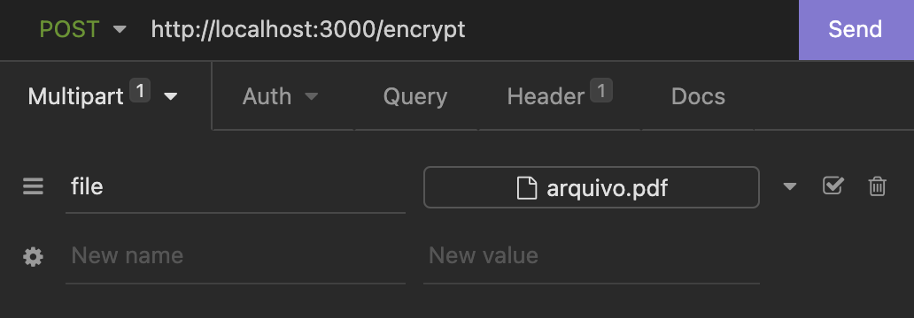

### Sobre

Esta API possui a função de criptografar um arquivo **_.pdf_** com uma senha gerada aleatoriamente.

### Arquitetura


O usuário envia via post request um arquivo **_.pdf_** para o endereço _http://localhost:3000/encrypt_.
Este método http do tipo post, fará a criptografia do arquivo com uma senha gerada aleatoriamente que será enviada como resposta da requisição, com essa senha o usuário poderá abrir o arquivo que será gerado como **encrypt-"nome-do-arquivo".pdf** na pasta raiz desta aplicação.

### Requisitos

- [NodeJS](https://nodejs.org/en/) instalado.
- [NPM](https://docs.npmjs.com/downloading-and-installing-node-js-and-npm) instalado.
- [Insomnia](https://insomnia.rest/download) ou qualquer outro API Rest Client instalado.

### Como realizar o deploy

A implantação deste ativo pode ser feita seguindo o guia abaixo:

- Para realizar a implantação deste ativo, é preciso primeiro clonar este repositório.

Depois disso, você pode seguir os seguintes passos:

- Abra o diretório onde os arquivos clonados estão localizados via terminal e execute o seguinte comando:

  ```
   npm i

   ou

   npm install
  ```

  - O comando acima deve instalar todos os módulos necessários para executar o aplicativo.

- Em seguida, execute a API:

  ```
  npm start
  ```

  - Depois disso, a API estará disponível em: http://localhost:3000/encrypt

### Guia API

Para executar a API, você deve realizar um _Post Request_ enviando um multipart-form do tipo _file_ com o arquivo denominado **_file_**.

A seguir um exemplo usando o API Rest Client [Insomnia](https://insomnia.rest/download):



Após realizar a requisição você deve receber uma resposta da seguinte maneira:


O arquivo criptografado ficará disponível na raiz da pasta da API da seguinte maneira:


O arquivo criptografado com senha é o arquvio **encrypt-arquivo.pdf**

Você pode testar essa API com o arquivo de exemplo disponível na pasta _example_.
